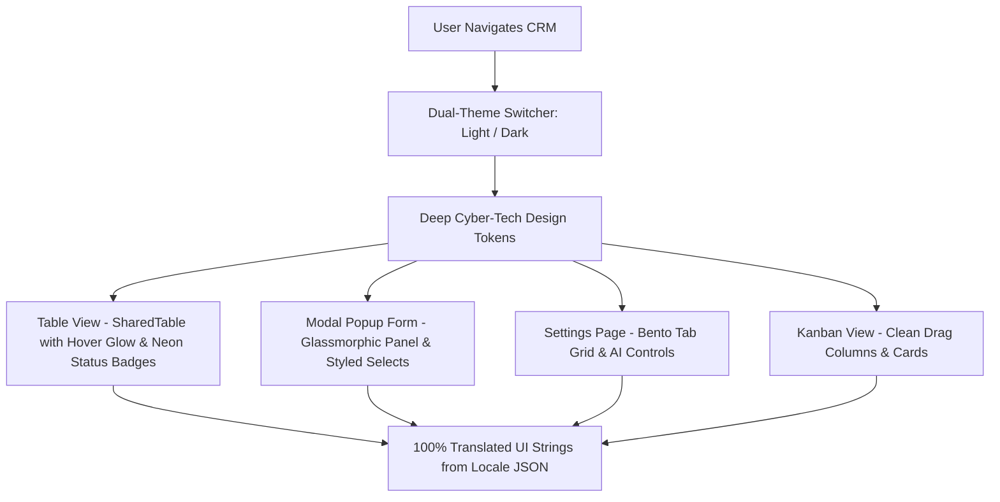

# Product Requirements Document (PRD): Deep Cyber-Tech Dual-Theme UI Overhaul

## 1. Executive Summary & Objectives
This document establishes the requirements for overhauling the **Xantivation CRM (`crm-fe`)** interface to a **Deep Cyber-Tech Aesthetic** supporting seamless **Dual Theme (Light & Dark)** modes.

### Key Refactoring Targets:
1. **Translation Key Integrity**: Fix missing locale keys across `translation.json` (`sidebar`, `header`, `leads`, `customers`, `opportunities`, `contracts`, `quotations`, `payments`, `deals`, `conversations`, `reports`) so no raw keys (e.g. `leads.title`, `header.searchPlaceholder`) display literally on screen.
2. **Table UI Refactor**: Eliminate white bottom scrollbar clipping, add hairline dividers (`0.5px`), neon status pills (`bg-cyan-500/10 text-cyan-400 border border-cyan-500/20`), and hover row glow (`bg-accent/[0.04]`).
3. **Modal Popup Form UI**: Redesign Modal overlays into glassmorphic Cyber-Tech panels (`backdrop-blur-xl border border-cyan-500/20 rounded-2xl shadow-2xl`), add styled section headers, custom select dropdowns, and fixed sticky footer action bars.
4. **Input & Form Controls**: Upgrade `FloatingInput` with gradient accent focus underlines (`from-[var(--color-accent)] to-cyan-500`), custom styled select dropdowns, textareas, and checkboxes.
5. **Settings Page (`/settings`) Overhaul**: Re-architect into an Asymmetric Bento Tab Grid, clean up ghost card borders, refactor tracked uppercase eyebrows to `font-sans font-semibold`, and add AI Governance & System Controls.
6. **Button System**: Add primary gradient shine buttons (`bg-gradient-to-r from-[var(--color-accent)] to-cyan-500 hover:opacity-90 shadow-md shadow-indigo-500/20 text-white rounded-xl`), secondary border buttons, and magnetic spring interactions.

---

## 2. Deep Cyber-Tech Dual-Theme Design Matrix

| UI Component | Dark Mode (Midnight Sapphire) | Light Mode (Ice Tinted Slate) |
| :--- | :--- | :--- |
| **Page Background** | `oklch(0.12 0.015 250)` (Deep Sapphire) | `oklch(0.985 0.008 250)` (Ice Slate Tint) |
| **Bento Panel Surface** | `oklch(0.145 0.015 250)` | `oklch(0.965 0.010 250)` |
| **Hairline Border** | `oklch(0.28 0.02 250 / 0.5)` (Subtle Cyan/Indigo) | `oklch(0.86 0.012 250 / 0.4)` |
| **Accent Glow** | Cyan / Electric Sapphire (`oklch(0.62 0.20 250)`) | Electric Indigo (`oklch(0.55 0.20 250)`) |
| **Modal Container** | Glassmorphic dark canvas with 0.5px cyan hairline border | Pure white glassmorphic canvas with slate hairline border |

---

## 3. Mermaid System Component Flow

